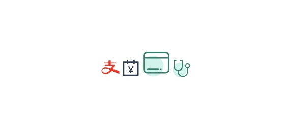

# 说明
svg 图标组件

# 安装
```bash
npm install @xiangwei/icon
```

# 使用
1）引入icon组件
```js
import Icon from 'icon';
```
2）将准备好的svg图片打包成js
```json
  "scripts": {
    "serve": "vue-cli-service serve",
     ...
    "build:icon": "icon build svg --source ./svg --output ./src/icon"
  },
```
3）添加项目图标  
> 说明：@/icon是在打包配置中定义的目录别名
```js
import alipayIcon from '@/icon/alipay.js';
import accountBookIcon from '@/icon/account-book.js';
import shebaoIcon from '@/icon/医疗_电子社保卡.js';
import tingzhenIcon from '@/icon/医疗_听诊.js';
Icon.add([alipayIcon, accountBookIcon, shebaoIcon, tingzhenIcon]);
```
或者可以使用require.context，将icon目录下所有的图标都引入进来
```js
const icons = require.context('@/icon', false, /\.js$/);
icons.keys().forEach(key => {
    const iconInstance = icons(key).default;
    Icon.add(iconInstance);
});
```
4）将Icon组件注册为全局组件(组件中定义了install方法)
```js
Vue.use(Icon);
```
5）在组件中使用

```html
  <div id="app">
      <icon name="alipay" fill="red"></icon>
      <icon name="account-book"></icon>
      <icon name="医疗_电子社保卡" size="30px"></icon>
      <icon name="医疗_听诊" class="hello-world"></icon>
  </div>
```


# 开发

## 编译组件

项目根目录
```bash
npm install
npm run build
```

## 查看demo
example目录
```bash
npm install
npm run serve
```
